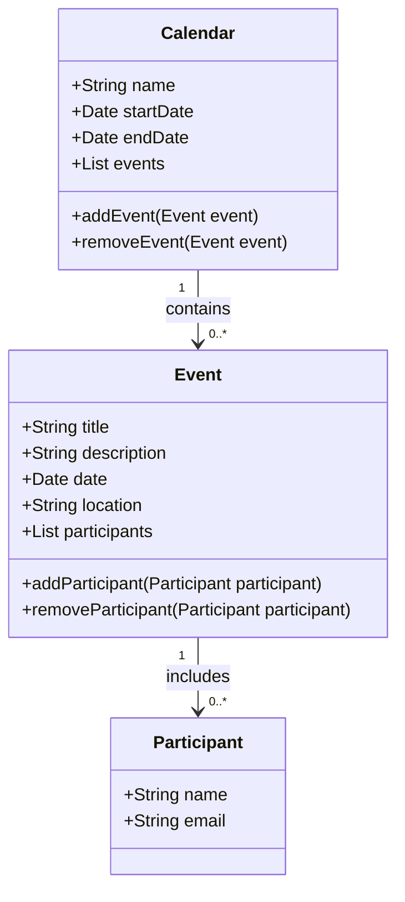

# API REST Bootcamp Claro X DIO

Módulo "Publicando Sua API REST na Nuvem Usando Spring Boot 3, Java 17 e Railway"

## Diagrama de Classes

```mermaid
classDiagram
    class Calendar {
        +String name
        +Date startDate
        +Date endDate
        +List<Event> events
        +addEvent(Event event)
        +removeEvent(Event event)
    }

    class Event {
        +String title
        +String description
        +Date date
        +String location
        +List<Participant> participants
        +addParticipant(Participant participant)
        +removeParticipant(Participant participant)
    }

    class Participant {
        +String name
        +String email
    }

    Calendar "1" --> "0..*" Event : contains
    Event "1" --> "0..*" Participant : includes
```
